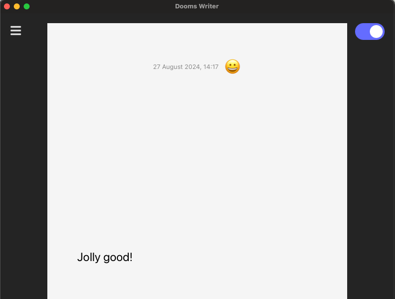
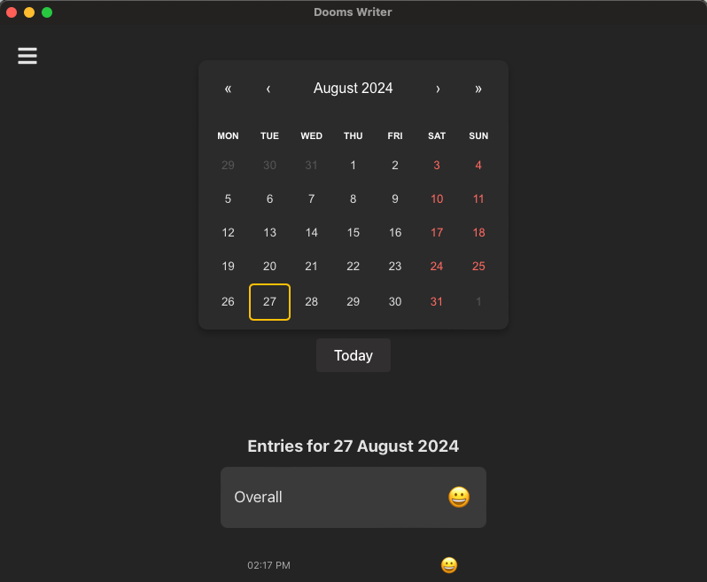

# DoomsWriter

  

> Note: Still under active development. Expect breaking changes and use with caution.

## Hello

DoomsWriter (DW) is a minimalistic journal app that destroys the text and retains the emotion.

It started as a way for me to learn React but I extended it a bit to embed small [DistilRoberta model](https://huggingface.co/j-hartmann/emotion-english-distilroberta-base) to do real-time emotion detection. The app is completely secure because it uses [transformers.js](https://huggingface.co/docs/transformers.js/index) to serve the model using ONNX Runtime and WASM.

## Features

The app is pretty basic and has two main views (or Components 😉️) -- Editor and Calendar.

- Type the text in the Editor and get real-time emotion recognition (this can be turned off if its too distracting).
- Capture the emotion and clear the text by pressing `Cmd + enter`.
- View the emotions in the Calendar. You can click the dates in the calendar to view previous emotions.

### Keyboard Shortcuts

DWriter is mostly keyboard driven.

- The shortcut `Cmd + ;` toggles between Editor and Calendar views.
- The shortcut `Cmd + enter` captures the current text.

  
  

### Emotions

DWriter only captures the emotions of your journal entry and forgets the actual text. Emotions are based on *Ekman's 6 basic emotions* and a neutral ([model card](https://huggingface.co/j-hartmann/emotion-english-distilroberta-base))

1. anger 🤬
2. disgust 🤢
3. fear 😨
4. joy 😀
5. neutral 😐
6. sadness 😭
7. surprise 😲

## Inside

The frontend is written in plain-ol Javascript and React. I took a gamble and used [Tauri](https://tauri.app/) instead of [Electron](https://josephg.com/blog/electron-is-flash-for-the-desktop/) for the multi-platform support, and so far it has been very plesant!

## Installation

> Note: Currently, we are in pre-release and the app is only supported on MacOS. Linux and Windows support on its way soon!

#### MacOS

You can download the `.dmg` from the releases and then remove the quarantine using `xattr -d com.apple.quarantine <dmg-file>`. Otherwise, MacOS might throw app is "damaged" error. If you find this sus, you can also build from source.

## Building from source

You need to have `node` and `tauri` installed.

- To install dependendies, run `npm install` from the root directory.

- `npm run dev` opens the app in dev mode with vite HR.
- `npm run build` creates the dist folder
- `npm run tauri dev` opens the app in Tauri dev mode (which is basically Edge browser)
- `npm run tauri build` to build the tauri app. The packaged app can be found in the releases folder (`src-tauri/target/release/bundle/`)

## Credits

The app uses `j-hartmann/emotion-english-distilroberta-base` with ONNX runtime and WASM to serve. Leave them a  ❤️️!

Am still learning React and benefited greatly from [Full Stack Open course](https://fullstackopen.com/en/) from UoH, specially for introducing me to vite!

And of course, GH Co-pilot, where will I be without you 😍️